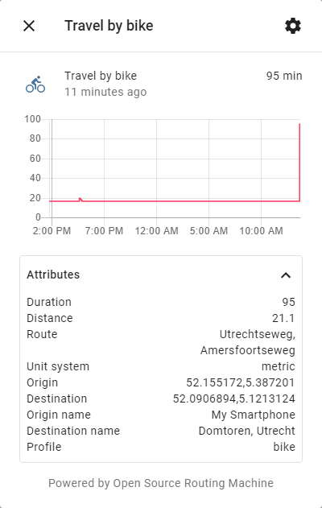

# OSRM Travel Time sensor for Home Assistant (osrm_travel_time)
This plugin is heavily based on https://github.com/eifinger/open_route_service and modified to use the https://pypi.org/project/osrm-py/ client for OSRM for making completely self-contained travel times in possible in Home Assistant.
You can specify origin and destination by either a device_tracker, zone or person entity_id or by latitude/longitude coordinates.



## Configuration
```yaml
sensor:
  - platform: osrm
    name: Travel home by bike
    server: 'https://route.example.com'
    profile: bike
    origin_entity_id: person.my_person
    destination_latitude: '52.0906894'
    destination_longitude: '5.1213124'
  - platform: osrm
    name: Travel home by car
    server: 'http://localhost:5000'
    profile: car
    origin_entity_id: device_tracker.my_device
    destination_entity_id: zone.home
```

## Configuration options
Key | Type | Required | Description
-- | -- | -- | --
`server` | `string` | `true` | Your OSRM server without path. The `profile` option will be included in the path.
`origin_entity_id` | `string` | `true` | The *entity_id* used as the starting point for calculating travel distance and time. Cannot be used in combination with `origin_latitude` / `origin_longitude`.
`origin_latitude` | `string` | `true` | The latitude of the starting point for calculating travel distance and time. Must be used in combination with `origin_longitude`. Cannot be used in combination with `origin_entity_id`.
`origin_longitude` | `string` | `true` | The longitude of the starting point for calculating travel distance and time. Must be used in combination with `origin_latitude`. Cannot be used in combination with `origin_entity_id`.
`origin_name` | `string` | `false` | Display name for the origin. If entity is used as origin, its name will be shown unless this option is specified.
`destination_entity_id` | `string` | `true` | The *entity_id* used as the end point for calculating travel distance and time. Cannot be used in combination with `destination_latitude`/`destination_longitude`.
`destination_latitude` | `string` | `true` | The latitude of the end point for calculating travel distance and time. Must be used in combination with `destination_longitude`. Cannot be used in combination with `destination_entity_id`.
`destination_longitude` | `string` | `true` | The longitude of the end point for calculating travel distance and time. Must be used in combination with `destination_latitude`. Cannot be used in combination with `destination_entity_id`.
`destination_name` | `string` | `false` | Display name for the destination. If entity is used as destination, its name will be shown unless this option is specified.
`name` | `string` | `false` | A name to display on the sensor. The default is *OSRM Travel Time*.
`profile` | `string` | `false` | Enter a profile name here, which exists in your OSRM server. The default is *car*.
`unit_system` | `string` | `false` | You can choose between `metric` or `imperial`. The default is to follow your Home Assistant configuration.
`scan_interval` | `integer` | `false` | "Defines the update interval of the sensor in seconds. Defaults to *300* (5 minutes)."

## Roadmap
Things I'd like to add
- [ ] Create config flow instead of configuring through YAML
- [ ] Fix slow initial update when entity is a `device_tracker`
- [ ] Add/improve documentation on configuring OSRM

## Bugs and support
If you find a bug or have a feature request, please let me know in the issue tracker or fork the plugin, add your feature and create a Pull Request. Please note that I do not provide any support on OSRM deployment or configuration, please see the [OSRM wiki](https://github.com/Project-OSRM/osrm-backend/wiki) for that.